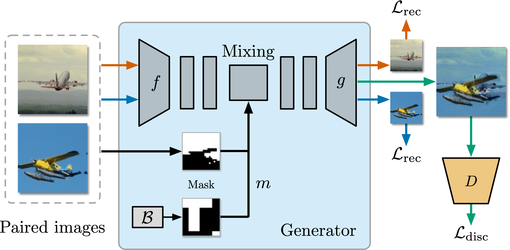

# ChimeraMix: Image Classification on Small Datasets via Masked Feature Mixing

This is the official implementation of the paper [ChimeraMix: Image Classification on Small Datasets via Masked Feature Mixing](https://arxiv.org/abs/2202.11616) (IJCAI-ECAI 2022).



## Abstract

Deep convolutional neural networks require large amounts of labeled data samples. For many real-world applications, this is a major limitation which is commonly treated by augmentation methods. In this work, we address the problem of learning deep neural networks on small datasets. Our proposed architecture called ChimeraMix learns a data augmentation by generating compositions of instances. The generative model encodes images in pairs, combines the features guided by a mask, and creates new samples. For evaluation, all methods are trained from scratch without any additional data. Several experiments on benchmark datasets, e.g., ciFAIR-10, STL-10, and ciFAIR-100, demonstrate the superior performance of ChimeraMix compared to current state-of-the-art methods for classification on small datasets.

## Citation

```bibtex
@inproceedings{chimeramix,
  title     = {ChimeraMix: Image Classification on Small Datasets via Masked Feature Mixing},
  author    = {Reinders, Christoph and Schubert, Frederik and Rosenhahn, Bodo},
  booktitle = {Proceedings of the Thirty-First International Joint Conference on
               Artificial Intelligence, {IJCAI-22}},
  publisher = {International Joint Conferences on Artificial Intelligence Organization},
  editor    = {Lud De Raedt},
  pages     = {1298--1305},
  year      = {2022},
  month     = {7},
  note      = {Main Track},
  doi       = {10.24963/ijcai.2022/181},
  url       = {https://doi.org/10.24963/ijcai.2022/181},
}
```

## Installation

The Anaconda environment can be created as follows.

```bash
conda env create -f environment.yaml
conda activate chimeramix
```

## Experiments

Training ChimeraMix on ciFAIR-10, ciFAIR-100, and STL-10 is shown in the following sections.
You can set the number of examples per class via the `max_labels_per_class` parameter.
The experiments require a single GPU with 10GB of memory, such as the NVIDIA GeForce GTX 1080 Ti.

### ciFAIR-10

```bash
# ChimeraMix+Grid
python train_generator.py +dataset=cifair10 +experiment=chimeramix_grid max_labels_per_class=5
python train_classifier.py +dataset=cifair10 +experiment=chimeramix_grid max_labels_per_class=5

# ChimeraMix+Seg
python train_generator.py +dataset=cifair10 +experiment=chimeramix_segmentation max_labels_per_class=5
python train_classifier.py +dataset=cifair10 +experiment=chimeramix_segmentation max_labels_per_class=5
```

### ciFAIR-100

```bash
# ChimeraMix+Grid
python train_generator.py +dataset=cifair100 +experiment=chimeramix_grid max_labels_per_class=5
python train_classifier.py +dataset=cifair100 +experiment=chimeramix_grid max_labels_per_class=5

# ChimeraMix+Seg
python train_generator.py +dataset=cifair100 +experiment=chimeramix_segmentation max_labels_per_class=5
python train_classifier.py +dataset=cifair100 +experiment=chimeramix_segmentation max_labels_per_class=5
```

### STL-10

```bash
# ChimeraMix+Grid
python train_generator.py +dataset=stl10 +experiment=chimeramix_grid max_labels_per_class=5
python train_classifier.py +dataset=stl10 +experiment=chimeramix_grid max_labels_per_class=5

# ChimeraMix+Seg
python train_generator.py +dataset=stl10 +experiment=chimeramix_segmentation max_labels_per_class=5
python train_classifier.py +dataset=stl10 +experiment=chimeramix_segmentation max_labels_per_class=5
```

## Experiment Sweeps

To reproduce all main experiments on your Slurm cluster, execute the following two commands.
Replace `<SLURM PARTITION>` with the name of your Slurm partition.

```bash
python train_generator.py "+dataset=glob(*)" "+experiment=glob(*)" "max_labels_per_class=5,10,20,30,50,100" "seed=range(0,5)" "hydra.launcher.partition=<SLURM PARTITION>" --multirun
python train_classifier.py "+dataset=glob(*)" "+experiment=glob(*)" "max_labels_per_class=5,10,20,30,50,100" "seed=range(0,5)" "hydra.launcher.partition=<SLURM PARTITION>" --multirun
```
